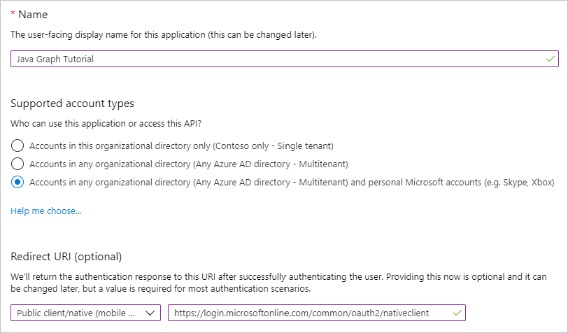
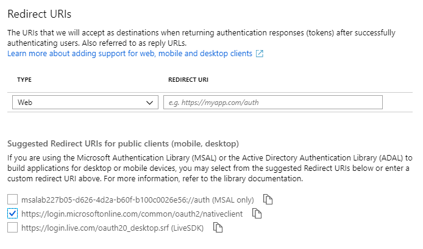

<!-- markdownlint-disable MD002 MD041 -->

Neste exercício, você criará um novo aplicativo do Azure AD usando o centro de administração do Azure Active Directory.In this exercise you will create a new Azure AD application using the Azure Active Directory admin center.

1. Abra um navegador, navegue até o [centro de administração do Azure Active Directory](https://aad.portal.azure.com) e faça logon usando uma **conta pessoal** (também conhecida como conta da Microsoft) ou **Conta Corporativa ou de Estudante**.Open a browser and navigate to the [Azure Active Directory admin center](https://aad.portal.azure.com) and login using a **personal account** (aka: Microsoft Account) or **Work or School Account**.

1. Selecione **Azure Active Directory** na navegação esquerda e selecione **Registros de aplicativos** em **Gerenciar**.Select **Azure Active Directory** in the left-hand navigation, then select **App registrations** under **Manage**.

    

1. Selecione **Novo registro**.Select **New registration**. Na página **Registrar um aplicativo**, defina os valores da seguinte forma.On the **Register an application** page, set the values as follows.

    - Defina **Nome** para `Java Graph Tutorial`.Set **Name** to `Java Graph Tutorial`.
    - Defina **Tipos de conta com suporte** para **Contas em qualquer diretório organizacional e contas pessoais da Microsoft**.Set **Supported account types** to **Accounts in any organizational directory and personal Microsoft accounts**.
    - Deixe o **URI de Redirecionamento** vazio.Leave **Redirect URI** empty.

    

1. Escolha **Registrar**.Choose **Register**. Na página **tutorial do Java Graph** , copie o valor da **ID do aplicativo (cliente)** e salve-o, você precisará dele na próxima etapa.On the **Java Graph Tutorial** page, copy the value of the **Application (client) ID** and save it, you will need it in the next step.

    

1. Selecione o link **Adicionar um URI de redirecionamento** .Select the **Add a Redirect URI** link. Na página **redirecionar URIs** , localize a seção **redirecionar URIs sugeridos para clientes públicos (móvel, área de trabalho)** .On the **Redirect URIs** page, locate the **Suggested Redirect URIs for public clients (mobile, desktop)** section. Selecione o `https://login.microsoftonline.com/common/oauth2/nativeclient` URI.Select the `https://login.microsoftonline.com/common/oauth2/nativeclient` URI.

    

1. Localize a seção **tipo de cliente padrão** e altere o **aplicativo tratar como um cliente público** alternar para **Sim**e, em seguida, escolha **salvar**.Locate the **Default client type** section and change the **Treat application as a public client** toggle to **Yes**, then choose **Save**.

    
